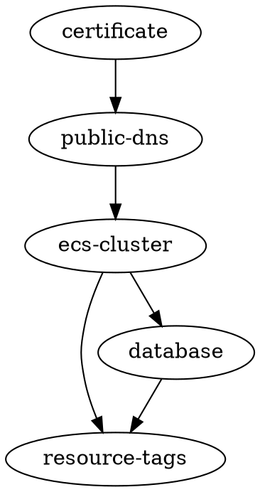

# dgr

Short for _directed graph_.

Takes a DOT-formatted `digraph` where dependencies are expressed as `dependent -> dependency`, determines the order in which they need to occur, and sorts the dependencies by earlier-to-later resolution.

With the `-node` parameter, you can specify one of the nodes in the graph, and this will display the list of dependencies beginning with the node you specified. The intended use-case is to assume that node's dependencies are met, so just perform the work for that node and everything which depends on it.

## Install

Assuming you have the [Go toolchain](https://golang.org/doc/install) set up, run:

```bash
go get github.com/skyzyx/dgr
```

## Usage

```bash
terragrunt graph-dependencies | dgr
```

## Use-case

My specific use-case is using [Terragrunt] to break apart monolithic [Terraform] into smaller, discrete _units_. (There's no need for an update to a Lambda function to execute the same monolithic Terraform as what powers my database.) These _units_ can [depend on each other](https://terragrunt.gruntwork.io/docs/features/keep-your-terraform-code-dry/), and Terragrunt knows how to track that.

By running `terragrunt graph-dependencies`, you can get Graphviz (DOT) data which looks something like this:



By piping that data into `dgr`, it will read the _directed acyclic graph_ (DAG) and sort the nodes in dependency order from _lots of things depend on me_ → _no things depend on me_.

If you pass the name of one of the nodes to the `-node` flag, it will give you a shorter version of the list starting with that node.

What this means is that if there is an update to one of my discrete units of Terraform (managed by Terragrunt), and I have other units which depend on that unit downstream, this will give me a list of the units which need to be re-applied in order for the changes to apply cleanly all the way through the stack.

## Generic use

I've tried to follow the Unix philosophy of doing one thing well, and supporting the ability to pipe things from one process to the next. I haven't broadly tested this (nor will I), but it should be able to sort nodes by their edges for _any_ Graphviz-formatted `digraph`.

Note that I have little idea how this graph stuff works. I've picked up a little here and there, but I don't understand it well enough to know how to implement it myself (sorry technical recruiters). I have an interest in learning, but I'd [need someone](https://tylercipriani.com/blog/2017/09/13/topographical-sorting-in-golang/) to [walk me though](https://github.com/philopon/go-toposort/blob/master/toposort.go) the [algorithm(s) first](https://github.com/stevenle/topsort/blob/master/topsort.go).

<https://xkcd.wtf/1988/>

  [Terragrunt]: https://terragrunt.gruntwork.io
  [Terraform]: https://terraform.io
